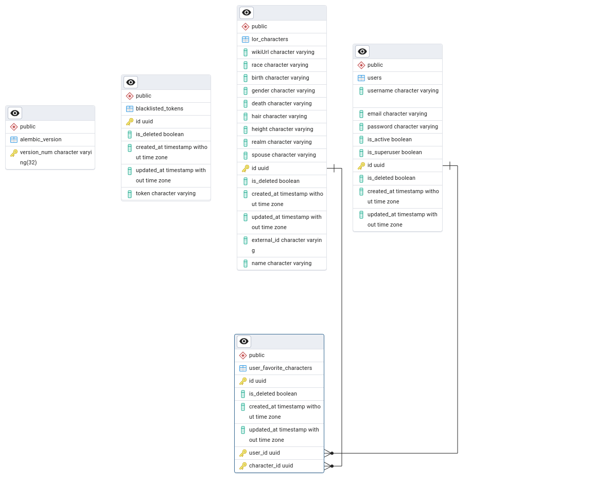
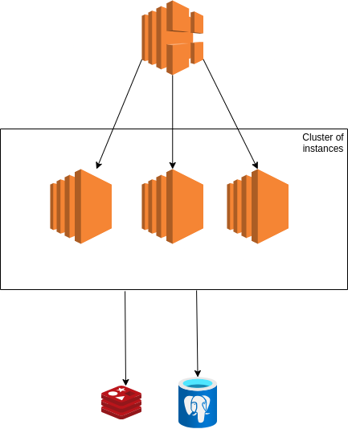

"""
# Tangent - Lord of the Rings API Service

A FastAPI-based REST API service that provides access to Lord of the Rings character data with user authentication and favorites management.

## Architecture Overview

### Core Components

#### Authentication System (`/src/auth/`)
- Complete JWT-based authentication system
- Access and refresh token management
- Token blacklisting capability
- User management (signup, login, refresh, signout)

#### Character Management (`/src/characters/`)
- Character data fetching and caching
- Favorite characters management
- Automatic data synchronization with external API
- Redis-based caching system

#### Database Layer
- PostgreSQL database with SQLModel ORM
- Alembic migrations
- Async database operations

### Key Features

1. **Authentication & Authorization**
   - JWT-based authentication
   - Token refresh mechanism
   - Token blacklisting for security
   - User registration and management

2. **Character Management**
   - CRUD operations for characters
   - Favorite characters functionality
   - Caching with Redis
   - Automatic data synchronization

3. **External API Integration**
   - Integration with Lord of the Rings API
   - Scheduled data updates
   - Error handling and retry mechanisms

## API Routes

### Authentication Routes (`/api/v1/auth/`)

---
```
POST /signup - Register new user
POST /login - User login
POST /refresh - Refresh access token
GET /me - Get current user info
POST /signout - User logout
```
---

### Character Routes (`/api/v1/characters/`)

---
```
GET / - List all characters
GET /{id} - Get specific character
GET /favorites - Get user's favorite characters
POST /{id}/favorites - Add character to favorites
DELETE /{id}/favorites - Remove character from favorites
```
---

## Project Structure

---
```
src/
├── auth/                 # Authentication module
│   ├── dependencies.py   # Auth dependencies
│   ├── models.py        # User and token models
│   ├── router.py        # Auth routes
│   ├── schemas.py       # Pydantic schemas
│   ├── service.py       # Business logic
│   └── utility.py       # Helper functions
│
├── characters/          # Characters module
│   ├── models.py       # Character models
│   ├── router.py       # Character routes
│   ├── schemas.py      # Data schemas
│   ├── service.py      # Business logic
│   └── tasks.py        # Background tasks
│
├── helpers/            # Helper modules
│   ├── models.py      # Base models
│   ├── redis.py       # Redis client
│   └── third_party/   # External API integration
│
├── main.py            # Application entry point
├── settings.py        # Configuration
├── db.py             # Database setup
└── routers.py        # Route registration
```
---

## ERD for the project



## Setup and Installation

1. Clone the repository
2. Create and activate virtual environment:
---
```bash
python -m venv venv
source venv/bin/activate  # Linux/Mac
venv\Scripts\activate     # Windows
```
---

3. Install dependencies:
---
```bash
pip install -r requirements.txt
```
---

4. Set up environment variables:
---
```bash
cp .env.example .env
# Edit .env with your configuration
```
---

5. Run migrations:
---
```bash
alembic upgrade head
```
---

6. Start the server:
---
```bash
python src/main.py
```
---

## Environment Variables

Required environment variables in `.env`:

---
```
# Database
DB_HOST=localhost
DB_PORT=5432
DB_NAME=tangent
DB_USER=postgres
DB_PASSWORD=your_password

# App
APP_NAME=Tangent
APP_HOST=0.0.0.0
APP_PORT=8000
NUMBER_OF_WORKERS=4

# JWT
secret_key=your_secret_key
algorithm=HS256
access_token_expire_minutes=30
refresh_token_expire_minutes=1440

# Redis
REDIS_HOST=localhost
REDIS_PORT=6379
REDIS_DB=0

# External API
LOR_API_KEY=your_api_key
LOR_API_BASE_URL=https://the-one-api.dev/v2
```
---

## Running the project locally
 -using docker:
  ```bash
  docker-compose up --build -d
  ```

## Testing the Apis
Please refer to `/api/docs/`

## Key Dependencies

- FastAPI: Web framework
- SQLModel: SQL database ORM
- Alembic: Database migrations
- Redis: Caching
- JWT: Authentication
- APScheduler: Background tasks
- PostgreSQL: Database
"""

## System design for future scalability

